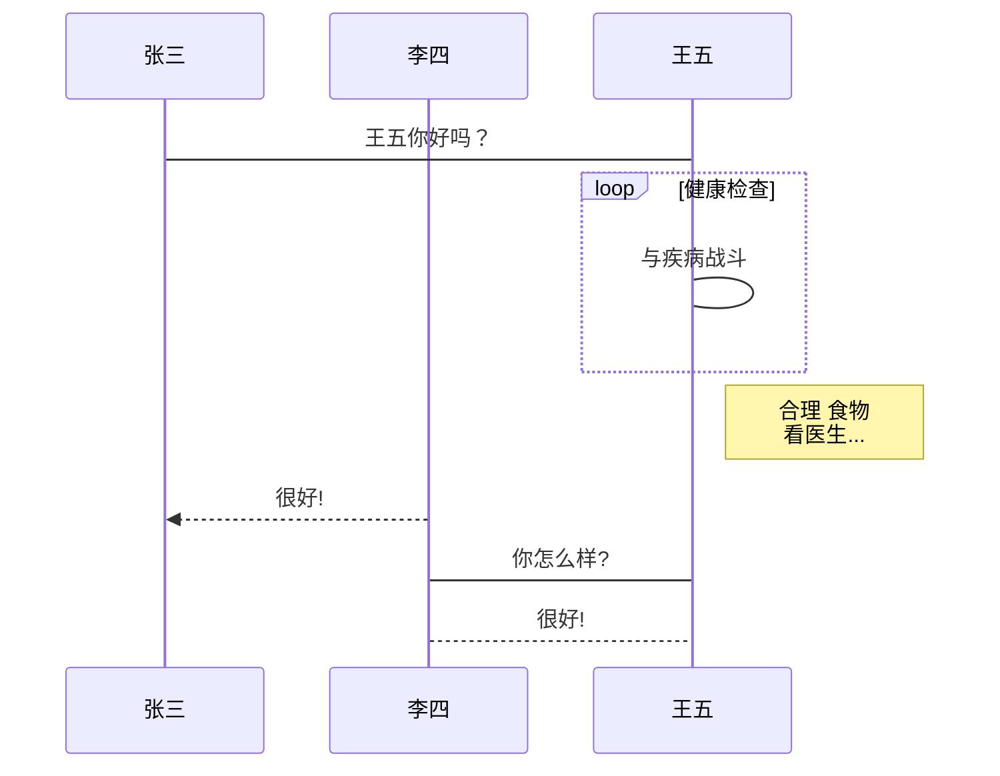

# hello world
## hello world
### hello world
段落  
两个空格+换行是段落  
*斜体字*  
**粗体字**  
***又粗又斜体***  
***

~~删除线~~ 两个波浪线  
<u>下划线</u>  
这是一个脚注的例子[^1]   
[^1]: 这里是脚注  
***  

行内代码(`markdown`)

1. 列表
2. 列表2
3. 列表3  

+ +列表
    * *嵌套列表
    * *嵌套列表2
        - -再嵌套

> 区块
> > 嵌套区块
> > > 再嵌套区块

> 区块+列表
> 1. 列表
> 2. 列表2

```c#
using system.io
console.writeline("hello world");
```
***  
链接地址啦啦  [百度](https://www.baidu.com)
<https://www.baidu.com>
链接地址啦啦啦需要空出一行，并需要开头两个空格 [baidu][2]  

  [2]: https://www.baidu.com/

***
#####表格要撑开才看的清楚左右中间对齐 :--   --:   :--:
| 表格1ddd | 表格2fff | 表格3ggg|
| :-----| ----: | :----: |
| 表格 | 表格 | 表格|
| 表格 | 表格 | 表格|

###高级应用

